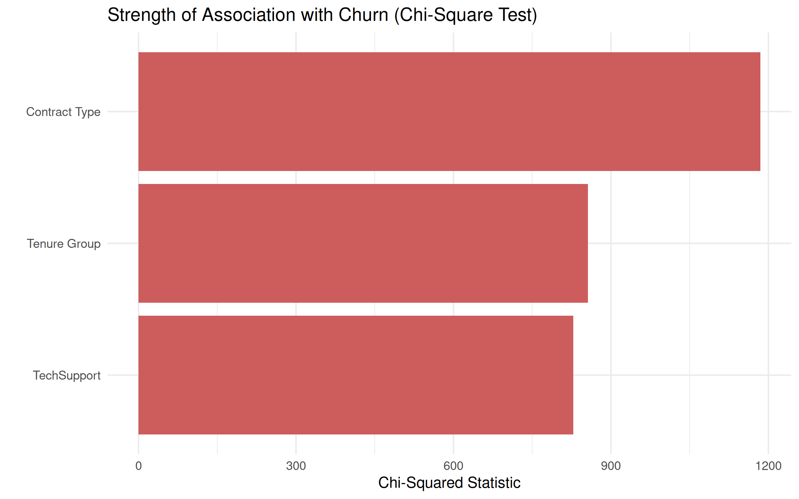

# Telco Customer Churn Analysis

Analysis of customer churn drivers for a telecom provider, using Python, SQL, R, and Power BI.

## Data Source

Telco Customer Churn dataset, originally released as part of IBM's Sample Data Sets,
distributed via Kaggle: https://www.kaggle.com/datasets/blastchar/telco-customer-churn
7,043 customers, 21 columns (demographics, account/contract info, subscribed services,
charges, and churn label).

## Stage 1: Questions

1. Which customer segments (contract type, tenure, payment method, internet service) have the highest/lowest churn rates?
2. Does tenure length or contract type predict churn more strongly - where's the "danger zone"?
3. Do add-on services (tech support, online security, streaming) correlate with retention?

## Stage 1: Findings

- **Overall churn rate:** 26.5%
- **Contract type:** Month-to-month customers churn at 42.7%, vs 11.3% for one-year and just 2.8% for two-year contracts — a ~15x gap between the extremes.
- **Tenure:** Churn is highest in the first 12 months (47.4%) and declines steadily with tenure, dropping to 9.5% by 49-72 months. Early tenure is the clearest "danger zone."
- **Add-on services:** Support/security services (OnlineSecurity, TechSupport) show the strongest retention effect (~2x lower churn with vs without). Entertainment add-ons (StreamingTV, StreamingMovies) show almost no effect on churn.
- **Combined risk profile:** Month-to-month customers in their first 12 months churn at 51.4% (vs 26.5% baseline). Within that group, those without TechSupport churn at 50.4% vs 30.7% with it — the single largest actionable segment (2,680 customers).

## Stage 2: Statistical Validation (R)

Chi-square tests confirm all three key drivers are statistically significant (p < 2.2e-16 for all):
- **Contract type**: X² = 1184.6 (strongest driver)
- **Tenure group**: X² = 856.1
- **TechSupport**: X² = 828.2

## Project Status

- [x] Data collection
- [x] Cleaning
- [x] EDA / visualization
- [x] SQL analysis
- [x] R statistical analysis
- [ ] Power BI dashboard

# telco-customer-churn-analysis
Customer churn analysis for a telecom provider using Python, SQL, R, and Power BI — identifying which customer segments and behaviors drive attrition, based on the IBM/Kaggle Telco Customer Churn dataset.

